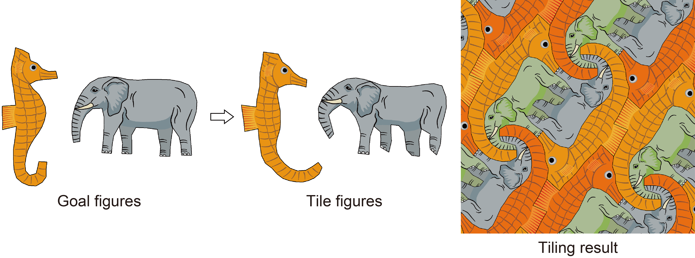

# Creation of Dihedral Escher-like Tilings Based on As-Rigid-As-Possible Deformation

This code is a C++ implementation of the algorithms developed in the following papers. 

[1] Yuichi Nagata and Shinji Imahori, Creation of Dihedral Escher-like Tilings Based on As-Rigid-As-Possible Deformation, ****, ****, ****, 2024. [[link]](https://dl.acm.org/doi/10.1145/3638048)

Outline: An Escher-like tiling is a tiling consisting of one or a few artistic shapes of tile. The proposed algorithm generates Escher-like tilings consisting of two distinct shapes (dihedral Escher-like tilings) that are as similar as possible to the two goal shapes specified by the user. Within the algorithm, the two tile shapes are optimized to minimize a distance function that measures the difference from the two goal shapes under the constraints that they can tile the plane. The distance between the tile and goal shapes is evaluated based on the as-rigid-as-possible (ARAP) deformation energy. This allows for the generation of satisfactory tile shapes by deforming the goal shapes in physically plausible ways even when large deformations of the goal shapes are indispensable to form possible tile shapes.

# Environment
The source code is implemented in C++ with the Eigen library. The author ran the program on Ubuntu 20.04, where the following preparation may be required to compile the source code. 
- Make the Eigen library [[link]](https://eigen.tuxfamily.org) available on your PC. 
- Install the X11 library on your PC. `$ sudo apt install libx11-dev`

# Directories
- Program: Source codes for generating and displaying tilings
- Data: files of goal shapes (mesh representation)
- Make_Polygon: A program for creating goal shapes (polygon)
- Make_Mesh: Source codes for constructing goal shapes (mesh)
